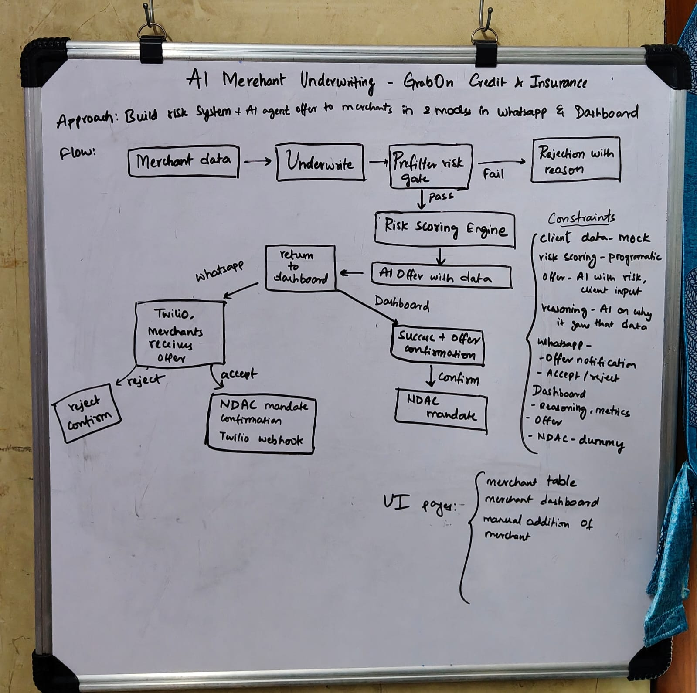
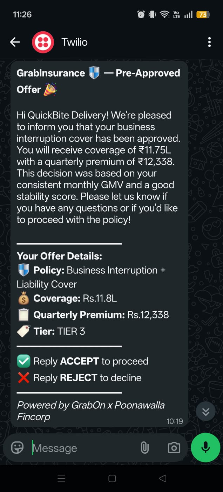
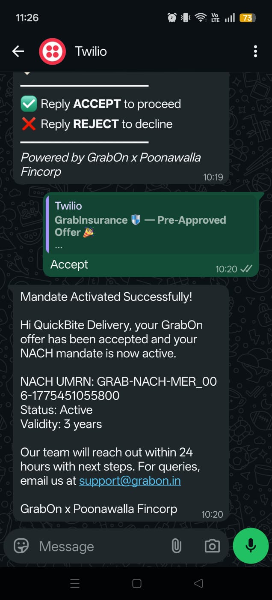
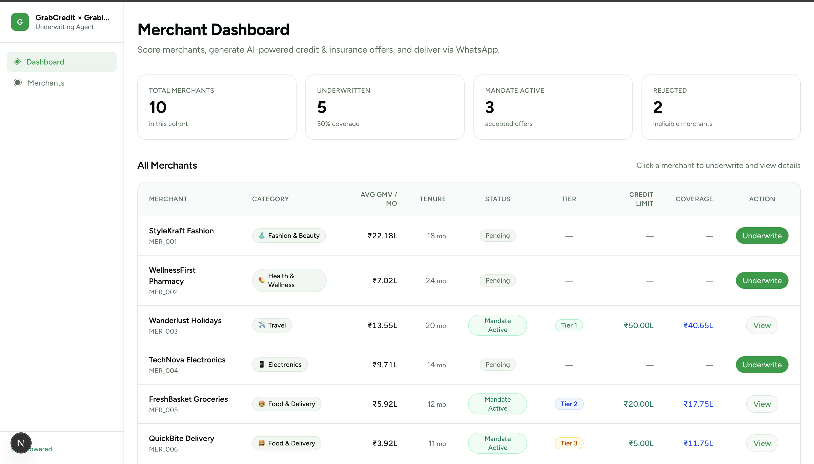
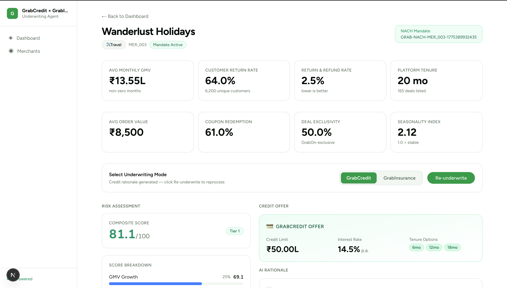
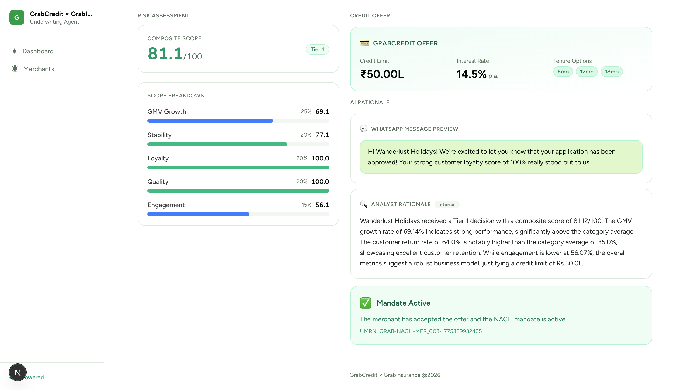
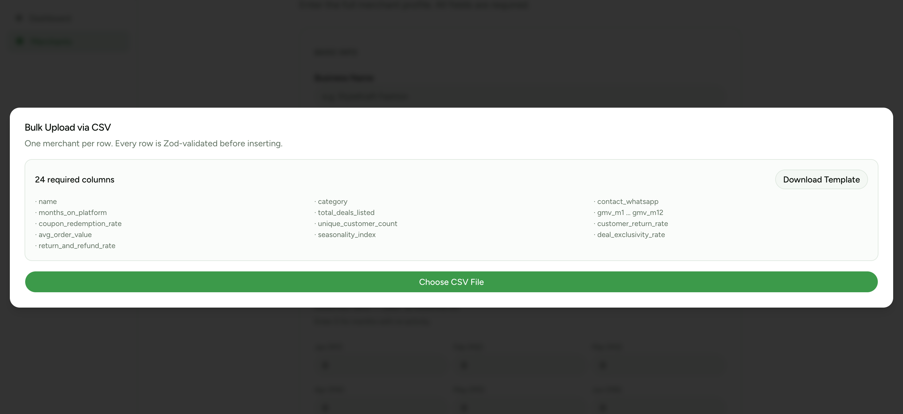

# Merchant Underwriting Agent

## Table of Contents

1. [What This Is](#what-this-is)
2. [Architecture](#architecture)
3. [Backend](#backend)
   - [What lives in each table](#what-lives-in-each-table)
   - [How the underwriting route works](#how-the-underwriting-route-works)
   - [How WhatsApp sending works](#how-whatsapp-sending-works)
   - [How the webhook works](#how-the-webhook-works)
4. [Setup](#setup)
   - [Backend](#backend-1)
   - [ngrok](#ngrok-required-for-whatsapp-webhook)
   - [Frontend](#frontend-1)
5. [Frontend](#frontend)
6. [Approach](#approach)
7. [Additional Features](#additional-features)

---

## What This Is

GrabOn runs a merchant rewards platform. The business problem is simple: which merchants deserve a credit line or an insurance product, and how do we communicate that decision to them without sounding like a bank rejection letter? This system scores merchants using their own platform data, calculates credit & insurance offers, and delivers them over WhatsApp/Dashboard with an explanation that actually makes sense to a merchant owner.

---

## Architecture



### VIDEO URL - 
[LIVE DEMO](https://www.loom.com/share/78e2214170f34eb8ab0222f7d2f73d5b)


**1. Deterministic scoring, not vibes.** The underwriting engine runs five weighted sub-scores against the merchant's 12-month GMV history and platform behavior. AI agent never touches a number. It only writes the explanation after the decision is made.

**2. PostgreSQL holds everything.** One `merchants` table for raw profile data, one `underwriting_results` table that stores both the offer and the AI rationale as JSONB, and a `whatsapp_logs` table that is the audit trail for every message sent or failed.

**3. WhatsApp is the delivery channel.** Twilio sends the offer. The merchant replies ACCEPT or REJECT. Twilio calls the webhook. The backend handles it with TwiML XML responses inline. No polling, no state machines, just a webhook. Over the dashboard as well, we can send the notification.

**4. The frontend is a workflow tool, not a report viewer.** Every merchant card has a linear state: not underwritten, underwritten, offer sent, mandate active. The UI only shows the action that makes sense for where the merchant currently is.

**5. AI is a fallback at the explanation layer.** If Claude or OpenAI fails, the system generates a deterministic rationale from templates using the same numbers. The offer still goes out. The score is unchanged.

---

## Backend

### What lives in each table

`merchants` stores the raw merchant input: name, category, phone, 12 months of GMV, return rate, refund rate, redemption rate, tenure, and deal counts. These are the inputs to scoring.

`underwriting_results` stores one row per merchant. It holds the risk tier, the full scoring breakdown (JSONB with all five sub-scores and composite), the credit offer, the insurance offer, both rationale texts (one per mode), and the current offer status. The `offer_status` column is an enum that moves in one direction: not underwritten, underwritten, offer sent, mandate active.

`whatsapp_logs` stores every outbound message attempt with the Twilio SID, the number it went to, the message body, the mode (credit or insurance), and whether it succeeded.

### How the underwriting route works

`POST /api/v1/underwrite/:id` does the following in order:

**Pre-filter (hard gates, binary)**

Three conditions are checked before any scoring happens. Fail any one and the merchant is rejected immediately with no score computed.

- Tenure on platform must be at least 6 months
- Average monthly GMV across active months must be at least Rs.50,000
- Refund rate must be below 10%

**Scoring engine (five sub-scores, each 0 to 100)**

All scores are computed only over non-zero GMV months.

GMV Growth (weight 25%) measures revenue trajectory. The active months are split into two halves. Growth rate = (avg second half - avg first half) / avg first half. Score = clamp(50 + growth_rate x 100, 0, 100). A flat merchant scores 50. A merchant growing 50% scores 100.

Stability (weight 20%) measures cash-flow predictability. Coefficient of variation = stddev / mean across the 12-month series. Score = clamp((1 - CV) x 100, 0, 100). CV near zero means perfectly stable revenue, scoring 100. CV near 1 means highly erratic, scoring near 0.

Loyalty (weight 20%) measures customer stickiness. Ratio = merchant return rate / category benchmark return rate. Score = clamp((ratio - 0.5) x 100, 0, 100). A merchant at 1x the benchmark scores 50. Above benchmark scores higher. Below 0.5x the benchmark scores 0.

Quality (weight 20%) measures product and service quality via refund rate, inverse relationship. Ratio = merchant refund rate / category benchmark refund rate. Score = clamp(((2.0 - ratio) / 1.5) x 100, 0, 100). A merchant at 0.5x the benchmark refund rate scores 100. At 2x or above, scores 0.

Engagement (weight 15%) measures platform commitment. Score = clamp((coupon_redemption_rate x 0.40 + deal_exclusivity_rate x 0.30 + min(tenure_months / 36, 1) x 0.30) x 100, 0, 100). Tenure is capped at 36 months so older merchants are not given an infinite advantage.

**Composite and tier mapping**

Composite = (GMV Growth x 0.25) + (Stability x 0.20) + (Loyalty x 0.20) + (Quality x 0.20) + (Engagement x 0.15)

Tier 1: composite >= 75. Tier 2: >= 50. Tier 3: >= 30. Rejected: below 30.

**Offer calculation (both modes always computed)**

Credit offer:
- Tier 1: limit = avg GMV x 6, capped at Rs.50L, rate 14.5%, tenures 6/12/18 months
- Tier 2: limit = avg GMV x 4, capped at Rs.20L, rate 16.5%, tenures 6/12 months
- Tier 3: limit = avg GMV x 2, capped at Rs.5L, rate 19.5%, tenure 6 months only

Insurance offer:
- Coverage = avg GMV x 3 (three months of revenue)
- Annual premium = coverage x category risk factor x tier multiplier
- Tier 1 gets a 0.85x discount on premium. Tier 2 pays standard 1.0x. Tier 3 pays 1.2x.
- Category risk factors: health_wellness 2.0%, fashion_beauty 2.5%, travel 2.8%, electronics 3.0%, food_delivery 3.5%
- Policy type is category-specific (e.g. electronics gets Transit Damage Cover, food delivery gets Liability Cover)
- Quarterly premium = annual / 4

**AI rationale call**

One call per underwrite request. The AI receives the full merchant profile, all five sub-scores, the composite, the calculated offer, and the category benchmark. It returns two fields: a WhatsApp-friendly message written for the merchant owner, and an internal analyst explanation with specific numbers cited. The output schema is enforced with Zod. If the call fails, deterministic templates produce the same content without personalization. The mode passed determines which rationale field gets written. The other mode's rationale is preserved unchanged if it was previously computed.

The result is upserted into `underwriting_results`.

### How WhatsApp sending works

`POST /api/v1/send-offer` takes a merchant ID and a mode. It pulls the underwriting result, picks the right user message (the one Claude wrote for that mode), and fires it through Twilio's WhatsApp API. The message SID, number, and status are written to `whatsapp_logs`. The merchant's `offer_status` moves to offer sent.

`POST /api/v1/accept-offer` is the manual acceptance path from the dashboard. It generates a NACH UMRN in the format `GRAB-NACH-{merchant_id}-{timestamp}`, stores it, and moves status to mandate active.

### How the webhook works

`POST /api/v1/underwrite/send-offer/webhook` is the Twilio inbound route. When a merchant replies to the WhatsApp message, Twilio hits this endpoint with the sender's number and the message body.

The handler ignores everything except the words ACCEPT and REJECT (case insensitive). For anything else it returns 200 silently. For REJECT it replies with a TwiML message saying the offer has been declined. For ACCEPT it looks up the merchant tied to that number via `whatsapp_logs`, validates that their tier is not rejected and their status is appropriate, generates the UMRN, updates the DB, and replies with a TwiML confirmation that includes the UMRN, validity period, and support contact. All responses are inline XML, no extra API calls.




---

## Setup

### Prerequisites

- Bun (backend runtime and package manager)
- Node.js with npm or bun (frontend)
- A Neon PostgreSQL database
- Twilio account with a WhatsApp-enabled number
- OpenAI API key (primary) and/or Anthropic API key (fallback)
- ngrok (for local webhook testing)

### Backend

```bash
cd backend
cp .env.example .env
```

Fill in the `.env` file:

```
OPENAI_API_KEY=
ANTHROPIC_API_KEY=
DB_URL=
PORT=8080
ENVIRONMENT=development
TWILIO_ACCOUNT_SID=
TWILIO_AUTH_TOKEN=
TWILIO_WHATSAPP_FROM=
```

Then install and run:

```bash
bun install
bun dev
```

The server starts on the port you set. On first boot it runs DB migrations automatically, so the tables are created if they do not exist yet.

The specific details of whatsapp, are shared via email, just paste them.

For TO phone number, use your number...
Do these exact steps:

1. Dm to the `TWILIO_WHATSAPP_FROM` number shared via email in whatsapp.
2. Paste this code : `join exist-dish`

Now your whatsapp is ready to interact!

### ngrok (required for WhatsApp webhook)

Twilio needs a public URL to forward inbound WhatsApp replies to. Run ngrok in a separate terminal:

```bash
ngrok http --domain=rubiginous-chillily-karter.ngrok-free.dev 8000
```

This is for responding to the ACCEPT/REJECT message of client.

** IF NGROK IS NOT INSTALLED THEN IGNORE, WE WONT GET NDAC via whatsapp **

Copy the forwarding URL (e.g. `https://abc123.ngrok.io`) and set the webhook URL in your Twilio WhatsApp sandbox settings to:

```
https://abc123.ngrok.io/api/v1/underwrite/send-offer/webhook
```

This is the route that handles ACCEPT and REJECT replies from merchants.

### Frontend

```bash
cd frontend
cp .env.example .env
```

Fill in the `.env` file:

```
NEXT_PUBLIC_API_URL=http://localhost:8080
```

Then install and run:

```bash
bun install
bun dev
```

Frontend runs on `http://localhost:3000` by default.

---

## Frontend

### MERCHANTs DASHBOARD




### MERCHANT ADD




**Dashboard** is the home page. It shows four summary numbers at the top: total merchants, how many have been underwritten, how many have an active mandate, and how many were rejected. Below that is a table of all merchants with their current status. Clicking a row goes to the detail page.

**Add Merchant** page has two paths. The single form takes all 24 fields manually with validation. The bulk upload option lets you download a CSV template, fill it in, and upload it. The backend validates each row individually and returns a breakdown of how many were inserted and which rows failed and why.

**Merchant Detail** page is where everything happens. At the top you see the merchant name, category, ID, and current status. There is a mode toggle between Credit and Insurance. Below that is a stats grid with tenure, deal count, average GMV, and other metrics.

The actions section is conditional. If the merchant has not been underwritten yet you see one button. After underwriting you see a different button to send via WhatsApp. After sending you can confirm acceptance manually from the dashboard (in addition to the webhook path). Once mandate is active it shows the UMRN and a confirmation state.

The scoring breakdown shows five horizontal bars, one per sub-score, with the raw number on each. The tier badge is shown prominently. The rationale panel shows both the analyst explanation and the user message, with a note about which mode they belong to. If you switch modes and the other mode has not been run yet, it triggers a new underwriting call automatically.

## Approach

1. TBH, this financial terms are new to me, the domain knowledge... so I invested kinda 3 hrs in understanding the terminology and all to come up with some clarity.
2. Then, wrote a plan, gave that to Claude Opus (Good cop role play) and then asked it to evaluate edge cases.
3. Post that, gave this to the Grok 4.1 Model (bad cop role play), it will spot every edge case, penalize the claude's output, find diff cases.
4. Then, I've wrote a detailed file, where I just maintain the core architecture and then used Claude code to code it off. 
5. Backend - 3 iterations in total (initital setup, core logic building, then workaround features)
6. Frontend - 4 iterations (all webpages were built in a single prompt, faced debugging sessions in fixing CSS issues :)

## Additional Features
- WhatsApp webhook interaction : User's mobile will receive the number, apart from that, we can also receive user's response from whatsapp using webhook.
- User addition feature : from the frontend only, we can add users data and play around with it.

Nice problem statement, in terms of finance, learned a good concept!