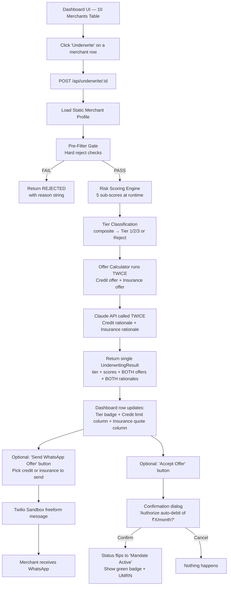

# Architecture.md

**Project 07: AI Merchant Underwriting Agent for GrabCredit & GrabInsurance**
**GrabOn Vibe Coder Challenge 2025**

---

## 1. Core Flow Diagram



**Key change from earlier draft:** There is NO mode selector. One "Underwrite" click scores the merchant once and computes BOTH credit and insurance offers simultaneously. The dashboard always shows both columns.

---

## 2. Tech Stack

| Layer | Choice |
|-------|--------|
| Runtime | Node.js 20 + TypeScript |
| Framework | Next.js 15 (App Router) — fullstack |
| AI | `@anthropic-ai/sdk` |
| Messaging | `twilio` |
| Validation | Zod |
| UI | shadcn/ui + Tailwind |
| State | In-memory Map (no DB) |
| Env | `.env.local` |

---

## 3. Project Structure

```
/src
├── app/
│   ├── page.tsx                                ← Dashboard (main screen)
│   ├── api/
│   │   ├── merchants/route.ts                  ← GET all merchants
│   │   ├── underwrite/[id]/route.ts            ← POST → scores + BOTH offers
│   │   └── send-offer/route.ts                 ← POST → Twilio WhatsApp
│   └── components/
│       ├── MerchantTable.tsx                    ← 10-row table
│       ├── ResultCard.tsx                       ← Both offers side by side
│       ├── ScoreBreakdown.tsx                   ← 5 sub-score progress bars
│       ├── NachConfirmDialog.tsx                ← Simple confirm/cancel dialog
│       └── WhatsAppPreview.tsx                  ← Message preview + send
├── data/
│   ├── merchants.ts                            ← 10 static merchant profiles
│   └── category-benchmarks.ts                  ← Category averages for rationale
├── lib/
│   ├── types.ts                                ← All types + enums
│   ├── pre-filter.ts                           ← Hard gate checks
│   ├── risk-scoring-engine.ts                  ← 5 sub-scores + composite
│   ├── offer-calculator.ts                     ← Credit + insurance amounts
│   ├── underwriting-agent.ts                   ← Claude API service
│   └── twilio-service.ts                       ← WhatsApp freeform delivery
└── store/
    └── results-store.ts                        ← In-memory results map
```

---

## 4. Data Types

```ts
// src/lib/types.ts

export type RiskTier = "Tier 1" | "Tier 2" | "Tier 3" | "Rejected";

export type OfferStatus = "not_underwritten" | "underwritten" | "offer_sent" | "mandate_active";

export interface MerchantProfile {
  merchant_id: string;
  name: string;
  category: string;
  contact_whatsapp: string;
  months_on_platform: number;
  total_deals_listed: number;
  monthly_gmv_12m: number[];           // 12 values in ₹
  coupon_redemption_rate: number;      // 0-1
  unique_customer_count: number;
  customer_return_rate: number;        // 0-1 (repeat buyer %)
  avg_order_value: number;             // ₹
  seasonality_index: number;           // ratio: peak/trough GMV (1.0 = stable, 3.0+ = volatile)
  deal_exclusivity_rate: number;       // 0-1
  return_and_refund_rate: number;      // 0-1
}

export interface CategoryBenchmark {
  avg_return_rate: number;
  avg_refund_rate: number;
  avg_monthly_gmv: number;
  avg_order_value: number;
}

export interface ScoringBreakdown {
  pre_filter_passed: boolean;
  pre_filter_reason?: string;
  gmv_growth_score: number;
  stability_score: number;
  loyalty_score: number;
  quality_score: number;
  engagement_score: number;
  composite_score: number;
}

export interface CreditOffer {
  credit_limit_inr: number;
  interest_rate_percent: number;
  tenure_options_months: number[];
}

export interface InsuranceOffer {
  coverage_amount_inr: number;
  annual_premium_inr: number;
  quarterly_premium_inr: number;
  policy_type: string;
}

export interface UnderwritingResult {
  merchant_id: string;
  merchant_name: string;
  risk_tier: RiskTier;
  scoring: ScoringBreakdown;
  credit_offer: CreditOffer | null;       // null if rejected
  insurance_offer: InsuranceOffer | null;  // null if rejected
  credit_rationale: string;               // Claude-generated
  insurance_rationale: string;            // Claude-generated
  offer_status: OfferStatus;
  whatsapp_status: "not_sent" | "sent" | "failed";
  whatsapp_message_sid?: string;
  nach_umrn?: string;                    // set on accept
  timestamp: string;
}
```

---

## 5. Static Data: 10 Merchant Profiles

```ts
// src/data/merchants.ts

import { MerchantProfile } from "@/lib/types";

export const merchants: MerchantProfile[] = [

  // ── TIER 1 (3 merchants) ──

  {
    merchant_id: "MER_001",
    name: "StyleKraft Fashion",
    category: "Fashion & Beauty",
    contact_whatsapp: "+917995938970",
    months_on_platform: 18,
    total_deals_listed: 142,
    monthly_gmv_12m: [
      1840000, 1920000, 2010000, 1980000, 2150000, 2280000,
      2340000, 2100000, 2450000, 2520000, 2480000, 2540000
    ],
    coupon_redemption_rate: 0.68,
    unique_customer_count: 12400,
    customer_return_rate: 0.71,
    avg_order_value: 2850,
    seasonality_index: 1.38,
    deal_exclusivity_rate: 0.45,
    return_and_refund_rate: 0.021,
  },

  {
    merchant_id: "MER_002",
    name: "WellnessFirst Pharmacy",
    category: "Health & Wellness",
    contact_whatsapp: "+917995938970",
    months_on_platform: 24,
    total_deals_listed: 198,
    monthly_gmv_12m: [
      620000, 640000, 680000, 650000, 700000, 710000,
      690000, 720000, 740000, 730000, 760000, 780000
    ],
    coupon_redemption_rate: 0.73,
    unique_customer_count: 8900,
    customer_return_rate: 0.82,
    avg_order_value: 1450,
    seasonality_index: 1.26,
    deal_exclusivity_rate: 0.55,
    return_and_refund_rate: 0.012,
  },

  {
    merchant_id: "MER_003",
    name: "Wanderlust Holidays",
    category: "Travel",
    contact_whatsapp: "+917995938970",
    months_on_platform: 20,
    total_deals_listed: 165,
    monthly_gmv_12m: [
      1100000, 850000, 920000, 1350000, 1580000, 1620000,
      1240000, 1050000, 1380000, 1650000, 1720000, 1800000
    ],
    coupon_redemption_rate: 0.61,
    unique_customer_count: 6200,
    customer_return_rate: 0.64,
    avg_order_value: 8500,
    seasonality_index: 2.12,
    deal_exclusivity_rate: 0.50,
    return_and_refund_rate: 0.025,
  },

  // ── TIER 2 (2 merchants) ──

  {
    merchant_id: "MER_004",
    name: "TechNova Electronics",
    category: "Electronics",
    contact_whatsapp: "+917995938970",
    months_on_platform: 14,
    total_deals_listed: 87,
    monthly_gmv_12m: [
      890000, 920000, 850000, 910000, 780000, 950000,
      1020000, 980000, 1100000, 1050000, 1120000, 1080000
    ],
    coupon_redemption_rate: 0.52,
    unique_customer_count: 5800,
    customer_return_rate: 0.48,
    avg_order_value: 7200,
    seasonality_index: 1.44,
    deal_exclusivity_rate: 0.20,
    return_and_refund_rate: 0.058,
  },

  {
    merchant_id: "MER_005",
    name: "FreshBasket Groceries",
    category: "Food & Delivery",
    contact_whatsapp: "+917995938970",
    months_on_platform: 12,
    total_deals_listed: 95,
    monthly_gmv_12m: [
      520000, 540000, 560000, 530000, 580000, 600000,
      610000, 590000, 620000, 640000, 650000, 660000
    ],
    coupon_redemption_rate: 0.58,
    unique_customer_count: 7100,
    customer_return_rate: 0.53,
    avg_order_value: 450,
    seasonality_index: 1.27,
    deal_exclusivity_rate: 0.25,
    return_and_refund_rate: 0.038,
  },

  // ── TIER 3 (2 merchants) ──

  {
    merchant_id: "MER_006",
    name: "QuickBite Delivery",
    category: "Food & Delivery",
    contact_whatsapp: "+917995938970",
    months_on_platform: 11,
    total_deals_listed: 54,
    monthly_gmv_12m: [
      320000, 380000, 290000, 420000, 510000, 710000,
      340000, 280000, 450000, 390000, 190000, 420000
    ],
    coupon_redemption_rate: 0.41,
    unique_customer_count: 3200,
    customer_return_rate: 0.39,
    avg_order_value: 680,
    seasonality_index: 3.74,
    deal_exclusivity_rate: 0.10,
    return_and_refund_rate: 0.063,
  },

  {
    merchant_id: "MER_007",
    name: "UrbanEscape Tours",
    category: "Travel",
    contact_whatsapp: "+917995938970",
    months_on_platform: 8,
    total_deals_listed: 32,
    monthly_gmv_12m: [
      0, 0, 0, 0, 210000, 380000,
      290000, 450000, 310000, 180000, 520000, 340000
    ],
    coupon_redemption_rate: 0.35,
    unique_customer_count: 1800,
    customer_return_rate: 0.31,
    avg_order_value: 5200,
    seasonality_index: 2.89,
    deal_exclusivity_rate: 0.08,
    return_and_refund_rate: 0.072,
  },

  // ── REJECTIONS (3 merchants — 3 different rejection reasons) ──

  {
    // REJECTION REASON: Pre-filter — less than 6 months on platform
    merchant_id: "MER_008",
    name: "NewTrend Accessories",
    category: "Fashion & Beauty",
    contact_whatsapp: "+917995938970",
    months_on_platform: 3,
    total_deals_listed: 12,
    monthly_gmv_12m: [
      0, 0, 0, 0, 0, 0,
      0, 0, 0, 85000, 110000, 130000
    ],
    coupon_redemption_rate: 0.22,
    unique_customer_count: 420,
    customer_return_rate: 0.23,
    avg_order_value: 1200,
    seasonality_index: 1.53,
    deal_exclusivity_rate: 0.05,
    return_and_refund_rate: 0.089,
  },

  {
    // REJECTION REASON: Pre-filter — refund rate exceeds 10%
    merchant_id: "MER_009",
    name: "GadgetZone Express",
    category: "Electronics",
    contact_whatsapp: "+917995938970",
    months_on_platform: 9,
    total_deals_listed: 28,
    monthly_gmv_12m: [
      0, 0, 0, 180000, 220000, 310000,
      280000, 250000, 190000, 160000, 140000, 120000
    ],
    coupon_redemption_rate: 0.29,
    unique_customer_count: 950,
    customer_return_rate: 0.21,
    avg_order_value: 4800,
    seasonality_index: 2.58,
    deal_exclusivity_rate: 0.05,
    return_and_refund_rate: 0.112,
  },

  {
    // REJECTION REASON: Passes pre-filter but composite score < 30 (scoring reject)
    // GMV is declining, near-zero engagement, terrible loyalty
    merchant_id: "MER_010",
    name: "GlowUp Beauty",
    category: "Fashion & Beauty",
    contact_whatsapp: "+917995938970",
    months_on_platform: 7,
    total_deals_listed: 22,
    monthly_gmv_12m: [
      0, 0, 0, 0, 0, 60000,
      55000, 48000, 42000, 38000, 35000, 30000
    ],
    coupon_redemption_rate: 0.18,
    unique_customer_count: 310,
    customer_return_rate: 0.15,
    avg_order_value: 980,
    seasonality_index: 2.0,
    deal_exclusivity_rate: 0.04,
    return_and_refund_rate: 0.095,
  },
];
```

### Expected Outcomes

| # | Merchant | Category | Outcome | Why |
|---|----------|----------|---------|-----|
| MER_001 | StyleKraft Fashion | Fashion & Beauty | **Tier 1** | Strong growth, 71% loyalty, 2.1% refunds |
| MER_002 | WellnessFirst Pharmacy | Health & Wellness | **Tier 1** | Ultra-stable, 82% loyalty, 1.2% refunds |
| MER_003 | Wanderlust Holidays | Travel | **Tier 1** | Growing despite seasonality, low refunds |
| MER_004 | TechNova Electronics | Electronics | **Tier 2** | Decent but 5.8% refunds, low exclusivity |
| MER_005 | FreshBasket Groceries | Food & Delivery | **Tier 2** | Steady but unexceptional everywhere |
| MER_006 | QuickBite Delivery | Food & Delivery | **Tier 3** | Extreme volatility (3.74 seasonality), 6.3% refunds |
| MER_007 | UrbanEscape Tours | Travel | **Tier 3** | New-ish, volatile, 31% loyalty |
| MER_008 | NewTrend Accessories | Fashion & Beauty | **Rejected** | Pre-filter: only 3 months on platform |
| MER_009 | GadgetZone Express | Electronics | **Rejected** | Pre-filter: 11.2% refund rate > 10% gate |
| MER_010 | GlowUp Beauty | Fashion & Beauty | **Rejected** | Passes pre-filter but composite < 30 (declining GMV, 15% loyalty) |

---

## 6. Category Benchmarks

```ts
// src/data/category-benchmarks.ts

import { CategoryBenchmark } from "@/lib/types";

export const CATEGORY_BENCHMARKS: Record<string, CategoryBenchmark> = {
  "Fashion & Beauty": {
    avg_return_rate: 0.52,
    avg_refund_rate: 0.048,
    avg_monthly_gmv: 1200000,
    avg_order_value: 2200,
  },
  "Electronics": {
    avg_return_rate: 0.41,
    avg_refund_rate: 0.042,
    avg_monthly_gmv: 950000,
    avg_order_value: 6500,
  },
  "Food & Delivery": {
    avg_return_rate: 0.45,
    avg_refund_rate: 0.041,
    avg_monthly_gmv: 800000,
    avg_order_value: 550,
  },
  "Health & Wellness": {
    avg_return_rate: 0.58,
    avg_refund_rate: 0.032,
    avg_monthly_gmv: 700000,
    avg_order_value: 1200,
  },
  "Travel": {
    avg_return_rate: 0.35,
    avg_refund_rate: 0.055,
    avg_monthly_gmv: 1500000,
    avg_order_value: 7500,
  },
};
```

---

## 7. Pre-Filter Gate

```ts
// src/lib/pre-filter.ts

import { MerchantProfile } from "./types";

interface PreFilterResult {
  passed: boolean;
  reason?: string;
}

export function runPreFilter(merchant: MerchantProfile): PreFilterResult {

  if (merchant.months_on_platform < 6) {
    return {
      passed: false,
      reason: `Insufficient platform tenure: ${merchant.months_on_platform} months (minimum 6 required)`,
    };
  }

  const nonZeroMonths = merchant.monthly_gmv_12m.filter((v) => v > 0);
  const avgGmv = nonZeroMonths.length > 0
    ? nonZeroMonths.reduce((a, b) => a + b, 0) / nonZeroMonths.length
    : 0;
  if (avgGmv < 50000) {
    return {
      passed: false,
      reason: `Average monthly GMV ₹${(avgGmv / 100000).toFixed(1)}L below minimum ₹0.5L`,
    };
  }

  if (merchant.return_and_refund_rate > 0.10) {
    return {
      passed: false,
      reason: `Refund rate ${(merchant.return_and_refund_rate * 100).toFixed(1)}% exceeds maximum 10% threshold`,
    };
  }

  return { passed: true };
}
```

---

## 8. Risk Scoring Engine

```ts
// src/lib/risk-scoring-engine.ts

import { MerchantProfile, ScoringBreakdown, RiskTier, CategoryBenchmark } from "./types";
import { runPreFilter } from "./pre-filter";

function calcGmvGrowthScore(gmv: number[]): number {
  const nonZero = gmv.filter((v) => v > 0);
  if (nonZero.length < 6) return 20;
  const mid = Math.floor(nonZero.length / 2);
  const avgFirst = nonZero.slice(0, mid).reduce((a, b) => a + b, 0) / mid;
  const avgSecond = nonZero.slice(mid).reduce((a, b) => a + b, 0) / (nonZero.length - mid);
  if (avgFirst === 0) return 10;
  const g = (avgSecond - avgFirst) / avgFirst;
  if (g < -0.2) return 0;
  if (g < 0) return 15 + (g + 0.2) * 75;
  if (g < 0.1) return 30 + g * 200;
  if (g < 0.3) return 50 + (g - 0.1) * 125;
  return Math.min(100, 75 + (g - 0.3) * 50);
}

function calcStabilityScore(gmv: number[]): number {
  const nonZero = gmv.filter((v) => v > 0);
  if (nonZero.length < 3) return 10;
  const mean = nonZero.reduce((a, b) => a + b, 0) / nonZero.length;
  const variance = nonZero.reduce((s, v) => s + Math.pow(v - mean, 2), 0) / nonZero.length;
  const cv = Math.sqrt(variance) / mean;
  if (cv < 0.1) return 90 + (0.1 - cv) * 100;
  if (cv < 0.25) return 65 + ((0.25 - cv) / 0.15) * 25;
  if (cv < 0.5) return 35 + ((0.5 - cv) / 0.25) * 30;
  return Math.max(0, 35 - (cv - 0.5) * 70);
}

function calcLoyaltyScore(rate: number, catAvg: number): number {
  if (catAvg === 0) return 50;
  const r = rate / catAvg;
  if (r >= 1.5) return Math.min(100, 80 + (r - 1.5) * 40);
  if (r >= 1.0) return 50 + ((r - 1.0) / 0.5) * 30;
  if (r >= 0.7) return 25 + ((r - 0.7) / 0.3) * 25;
  return (r / 0.7) * 25;
}

function calcQualityScore(refundRate: number, catAvg: number): number {
  if (catAvg === 0) return 50;
  const r = refundRate / catAvg;
  if (r < 0.5) return 80 + (0.5 - r) * 40;
  if (r <= 1.0) return 50 + ((1.0 - r) / 0.5) * 30;
  if (r <= 1.5) return 25 + ((1.5 - r) / 0.5) * 25;
  return Math.max(0, 25 - (r - 1.5) * 50);
}

function calcEngagementScore(redemption: number, exclusivity: number, months: number): number {
  return (redemption * 100) * 0.4 + (exclusivity * 100) * 0.3 + Math.min(100, months * 5) * 0.3;
}

export function scoreMerchant(
  merchant: MerchantProfile,
  benchmark: CategoryBenchmark
): { scoring: ScoringBreakdown; tier: RiskTier } {

  const preFilter = runPreFilter(merchant);
  if (!preFilter.passed) {
    return {
      scoring: {
        pre_filter_passed: false,
        pre_filter_reason: preFilter.reason,
        gmv_growth_score: 0, stability_score: 0, loyalty_score: 0,
        quality_score: 0, engagement_score: 0, composite_score: 0,
      },
      tier: "Rejected",
    };
  }

  const gmvGrowth = calcGmvGrowthScore(merchant.monthly_gmv_12m);
  const stability = calcStabilityScore(merchant.monthly_gmv_12m);
  const loyalty = calcLoyaltyScore(merchant.customer_return_rate, benchmark.avg_return_rate);
  const quality = calcQualityScore(merchant.return_and_refund_rate, benchmark.avg_refund_rate);
  const engagement = calcEngagementScore(
    merchant.coupon_redemption_rate, merchant.deal_exclusivity_rate, merchant.months_on_platform
  );

  const composite =
    gmvGrowth * 0.25 + stability * 0.20 + loyalty * 0.20 + quality * 0.20 + engagement * 0.15;

  const round = (n: number) => Math.round(n * 10) / 10;

  let tier: RiskTier;
  if (composite >= 75) tier = "Tier 1";
  else if (composite >= 50) tier = "Tier 2";
  else if (composite >= 30) tier = "Tier 3";
  else tier = "Rejected";

  return {
    scoring: {
      pre_filter_passed: true,
      gmv_growth_score: round(gmvGrowth),
      stability_score: round(stability),
      loyalty_score: round(loyalty),
      quality_score: round(quality),
      engagement_score: round(engagement),
      composite_score: round(composite),
    },
    tier,
  };
}
```

---

## 9. Offer Calculator

```ts
// src/lib/offer-calculator.ts

import { MerchantProfile, RiskTier, CreditOffer, InsuranceOffer } from "./types";

const CREDIT_CONFIG: Record<string, { multiplier: number; rate: number; tenures: number[] }> = {
  "Tier 1": { multiplier: 6, rate: 14.5, tenures: [6, 12, 18] },
  "Tier 2": { multiplier: 4, rate: 16.5, tenures: [6, 12] },
  "Tier 3": { multiplier: 2, rate: 19.5, tenures: [6] },
};

const MAX_CREDIT: Record<string, number> = {
  "Tier 1": 5000000,
  "Tier 2": 2000000,
  "Tier 3": 500000,
};

const INSURANCE_CONFIG: Record<string, { policy: string; risk_factor: number }> = {
  "Fashion & Beauty":  { policy: "Inventory Protection + Business Interruption", risk_factor: 0.025 },
  "Electronics":       { policy: "Inventory Protection + Transit Damage Cover",  risk_factor: 0.030 },
  "Food & Delivery":   { policy: "Business Interruption + Liability Cover",      risk_factor: 0.035 },
  "Health & Wellness": { policy: "Business Interruption + Compliance Cover",     risk_factor: 0.020 },
  "Travel":            { policy: "Business Interruption + Cancellation Cover",   risk_factor: 0.028 },
};

const TIER_PREMIUM_MULTIPLIER: Record<string, number> = {
  "Tier 1": 0.85,
  "Tier 2": 1.0,
  "Tier 3": 1.20,
};

function getAvgGmv(merchant: MerchantProfile): number {
  const nonZero = merchant.monthly_gmv_12m.filter((v) => v > 0);
  return nonZero.length > 0 ? nonZero.reduce((a, b) => a + b, 0) / nonZero.length : 0;
}

export function calcCreditOffer(merchant: MerchantProfile, tier: RiskTier): CreditOffer | null {
  if (tier === "Rejected") return null;
  const config = CREDIT_CONFIG[tier];
  const limit = Math.min(getAvgGmv(merchant) * config.multiplier, MAX_CREDIT[tier]);
  return {
    credit_limit_inr: Math.round(limit),
    interest_rate_percent: config.rate,
    tenure_options_months: config.tenures,
  };
}

export function calcInsuranceOffer(merchant: MerchantProfile, tier: RiskTier): InsuranceOffer | null {
  if (tier === "Rejected") return null;
  const catConfig = INSURANCE_CONFIG[merchant.category];
  if (!catConfig) return null;
  const coverage = getAvgGmv(merchant) * 3;
  const annual = coverage * catConfig.risk_factor * TIER_PREMIUM_MULTIPLIER[tier];
  return {
    coverage_amount_inr: Math.round(coverage),
    annual_premium_inr: Math.round(annual),
    quarterly_premium_inr: Math.round(annual / 4),
    policy_type: catConfig.policy,
  };
}
```

---

## 10. Claude Underwriting Agent

Claude is called **twice per underwrite** — once for credit rationale, once for insurance rationale. Same merchant data, same scores, different framing.

```ts
// src/lib/underwriting-agent.ts

import Anthropic from "@anthropic-ai/sdk";
import { MerchantProfile, RiskTier, ScoringBreakdown, CategoryBenchmark,
         CreditOffer, InsuranceOffer } from "./types";

const client = new Anthropic();

const SYSTEM_PROMPT = `You are a senior financial underwriting analyst at GrabOn.

Write a 3-5 sentence rationale explaining why this merchant received their risk tier and offer.

RULES:
- Reference SPECIFIC numbers from the merchant data (exact %, exact ₹ amounts)
- Compare to category averages where relevant
- For rejections: explain what failed and what the merchant can improve
- For Tier 3: acknowledge risks while noting positives
- Output ONLY the rationale text. No headers, no bullets, no JSON.
- Do NOT invent data. Only use numbers provided below.`;

function buildUserPrompt(
  mode: "credit" | "insurance",
  merchant: MerchantProfile,
  tier: RiskTier,
  scoring: ScoringBreakdown,
  creditOffer: CreditOffer | null,
  insuranceOffer: InsuranceOffer | null,
  benchmark: CategoryBenchmark,
): string {
  const nonZero = merchant.monthly_gmv_12m.filter(v => v > 0);
  const avgGmv = nonZero.reduce((a, b) => a + b, 0) / nonZero.length;

  let offerLine: string;
  if (tier === "Rejected") {
    offerLine = "No offer extended.";
  } else if (mode === "credit" && creditOffer) {
    offerLine = `Credit Limit: ₹${(creditOffer.credit_limit_inr / 100000).toFixed(1)}L | Rate: ${creditOffer.interest_rate_percent}% p.a. | Tenure: ${creditOffer.tenure_options_months.join("/")} months`;
  } else if (mode === "insurance" && insuranceOffer) {
    offerLine = `Coverage: ₹${(insuranceOffer.coverage_amount_inr / 100000).toFixed(1)}L | Premium: ₹${insuranceOffer.quarterly_premium_inr.toLocaleString("en-IN")}/qtr | Policy: ${insuranceOffer.policy_type}`;
  } else {
    offerLine = "No offer for this mode.";
  }

  return `
MODE: ${mode === "credit" ? "GrabCredit (Working Capital Loan)" : "GrabInsurance (Business Interruption Cover)"}

MERCHANT:
- Name: ${merchant.name}
- Category: ${merchant.category}
- Months on Platform: ${merchant.months_on_platform}
- Avg Monthly GMV: ₹${(avgGmv / 100000).toFixed(1)}L
- Monthly GMV (12m): ${merchant.monthly_gmv_12m.map(v => `₹${(v / 100000).toFixed(1)}L`).join(", ")}
- Customer Return Rate: ${(merchant.customer_return_rate * 100).toFixed(1)}% (Category Avg: ${(benchmark.avg_return_rate * 100).toFixed(1)}%)
- Refund Rate: ${(merchant.return_and_refund_rate * 100).toFixed(1)}% (Category Avg: ${(benchmark.avg_refund_rate * 100).toFixed(1)}%)
- Coupon Redemption Rate: ${(merchant.coupon_redemption_rate * 100).toFixed(1)}%
- Deal Exclusivity Rate: ${(merchant.deal_exclusivity_rate * 100).toFixed(1)}%
- Seasonality Index: ${merchant.seasonality_index}

SCORES:
- GMV Growth: ${scoring.gmv_growth_score}/100 (25%)
- Stability: ${scoring.stability_score}/100 (20%)
- Loyalty: ${scoring.loyalty_score}/100 (20%)
- Quality: ${scoring.quality_score}/100 (20%)
- Engagement: ${scoring.engagement_score}/100 (15%)
- Composite: ${scoring.composite_score}/100
${!scoring.pre_filter_passed ? `- Pre-filter rejection: ${scoring.pre_filter_reason}` : ""}

DECISION: ${tier}
OFFER: ${offerLine}

Write the rationale (3-5 sentences):`;
}

export async function generateRationale(
  mode: "credit" | "insurance",
  merchant: MerchantProfile,
  tier: RiskTier,
  scoring: ScoringBreakdown,
  creditOffer: CreditOffer | null,
  insuranceOffer: InsuranceOffer | null,
  benchmark: CategoryBenchmark,
): Promise<string> {
  const response = await client.messages.create({
    model: "claude-sonnet-4-20250514",
    max_tokens: 500,
    system: SYSTEM_PROMPT,
    messages: [{
      role: "user",
      content: buildUserPrompt(mode, merchant, tier, scoring, creditOffer, insuranceOffer, benchmark),
    }],
  });
  const block = response.content.find((b) => b.type === "text");
  return block?.text ?? "Unable to generate rationale.";
}
```

---

## 11. Twilio WhatsApp Service

```ts
// src/lib/twilio-service.ts

import twilio from "twilio";
import { UnderwritingResult } from "./types";

const client = twilio(process.env.TWILIO_ACCOUNT_SID!, process.env.TWILIO_AUTH_TOKEN!);
const SANDBOX_FROM = "whatsapp:+14155238886";

export async function sendWhatsAppOffer(
  toNumber: string,
  result: UnderwritingResult,
  mode: "credit" | "insurance",
): Promise<{ success: boolean; messageSid?: string; error?: string }> {
  try {
    const body = composeMessage(result, mode);
    const message = await client.messages.create({
      from: SANDBOX_FROM,
      to: `whatsapp:${toNumber}`,
      body,
    });
    return { success: true, messageSid: message.sid };
  } catch (error: any) {
    return { success: false, error: error.message };
  }
}

function composeMessage(result: UnderwritingResult, mode: "credit" | "insurance"): string {
  if (result.risk_tier === "Rejected") {
    return `🏦 GrabCredit — Application Update

Hi ${result.merchant_name},

After reviewing your GrabOn merchant profile, we're unable to extend an offer at this time.

${result.credit_rationale}

We automatically re-evaluate all merchants quarterly.
Powered by GrabCredit × Poonawalla Fincorp`;
  }

  if (mode === "credit" && result.credit_offer) {
    const c = result.credit_offer;
    return `🏦 GrabCredit Pre-Approved Offer

Hi ${result.merchant_name},

You've been pre-approved for:
💰 Working Capital: ₹${(c.credit_limit_inr / 100000).toFixed(0)}L
📊 Rate: ${c.interest_rate_percent}% p.a. (${result.risk_tier})
📅 Tenure: ${c.tenure_options_months.join(" / ")} months

Why you qualified:
${result.credit_rationale}

Reply ACCEPT to proceed or DETAILS for full terms.
Powered by GrabCredit × Poonawalla Fincorp`;
  }

  if (mode === "insurance" && result.insurance_offer) {
    const ins = result.insurance_offer;
    return `🛡️ GrabInsurance Pre-Approved Offer

Hi ${result.merchant_name},

You're eligible for:
🛡️ ${ins.policy_type}
💰 Coverage: ₹${(ins.coverage_amount_inr / 100000).toFixed(1)}L
📊 Premium: ₹${ins.quarterly_premium_inr.toLocaleString("en-IN")}/quarter

Why you qualified:
${result.insurance_rationale}

Reply ACCEPT to proceed or DETAILS for full terms.
Powered by GrabInsurance × Poonawalla Fincorp`;
  }

  return "Error composing message.";
}
```

---

## 12. API Routes

### POST /api/underwrite/[id] — THE MAIN ENDPOINT

One call. Scores once. Computes both offers. Generates both rationales.

```ts
// src/app/api/underwrite/[id]/route.ts

import { NextRequest, NextResponse } from "next/server";
import { merchants } from "@/data/merchants";
import { CATEGORY_BENCHMARKS } from "@/data/category-benchmarks";
import { scoreMerchant } from "@/lib/risk-scoring-engine";
import { calcCreditOffer, calcInsuranceOffer } from "@/lib/offer-calculator";
import { generateRationale } from "@/lib/underwriting-agent";
import { UnderwritingResult } from "@/lib/types";

// In-memory store
const resultsStore = new Map<string, UnderwritingResult>();
export { resultsStore };

export async function POST(
  request: NextRequest,
  { params }: { params: { id: string } }
) {
  const merchant = merchants.find((m) => m.merchant_id === params.id);
  if (!merchant) {
    return NextResponse.json({ error: "Merchant not found" }, { status: 404 });
  }

  const benchmark = CATEGORY_BENCHMARKS[merchant.category];
  if (!benchmark) {
    return NextResponse.json({ error: "Unknown category" }, { status: 400 });
  }

  // Step 1: Score (once)
  const { scoring, tier } = scoreMerchant(merchant, benchmark);

  // Step 2: Calculate both offers
  const creditOffer = calcCreditOffer(merchant, tier);
  const insuranceOffer = calcInsuranceOffer(merchant, tier);

  // Step 3: Generate both rationales (parallel)
  const [creditRationale, insuranceRationale] = await Promise.all([
    generateRationale("credit", merchant, tier, scoring, creditOffer, insuranceOffer, benchmark),
    generateRationale("insurance", merchant, tier, scoring, creditOffer, insuranceOffer, benchmark),
  ]);

  // Step 4: Build result
  const result: UnderwritingResult = {
    merchant_id: merchant.merchant_id,
    merchant_name: merchant.name,
    risk_tier: tier,
    scoring,
    credit_offer: creditOffer,
    insurance_offer: insuranceOffer,
    credit_rationale: creditRationale,
    insurance_rationale: insuranceRationale,
    offer_status: tier === "Rejected" ? "not_underwritten" : "underwritten",
    whatsapp_status: "not_sent",
    timestamp: new Date().toISOString(),
  };

  resultsStore.set(merchant.merchant_id, result);
  return NextResponse.json({ result });
}
```

**Note:** Both Claude calls run in parallel via `Promise.all` — total latency is ~2-3 seconds (one Claude call), not 4-6 seconds (two sequential calls).

### POST /api/send-offer

```ts
// src/app/api/send-offer/route.ts

import { NextRequest, NextResponse } from "next/server";
import { merchants } from "@/data/merchants";
import { sendWhatsAppOffer } from "@/lib/twilio-service";
import { UnderwritingResult } from "@/lib/types";

export async function POST(request: NextRequest) {
  const { merchantId, result, mode } = await request.json() as {
    merchantId: string;
    result: UnderwritingResult;
    mode: "credit" | "insurance";
  };

  const merchant = merchants.find((m) => m.merchant_id === merchantId);
  if (!merchant) {
    return NextResponse.json({ error: "Merchant not found" }, { status: 404 });
  }

  const delivery = await sendWhatsAppOffer(merchant.contact_whatsapp, result, mode);

  return NextResponse.json({
    whatsapp_status: delivery.success ? "sent" : "failed",
    message_sid: delivery.messageSid,
    error: delivery.error,
  });
}
```

### POST /api/accept-offer — NACH MANDATE

```ts
// src/app/api/accept-offer/route.ts

import { NextRequest, NextResponse } from "next/server";
import { resultsStore } from "../underwrite/[id]/route";

export async function POST(request: NextRequest) {
  const { merchantId } = await request.json();

  const result = resultsStore.get(merchantId);
  if (!result) {
    return NextResponse.json({ error: "No underwriting result found" }, { status: 404 });
  }
  if (result.risk_tier === "Rejected") {
    return NextResponse.json({ error: "Cannot accept a rejected offer" }, { status: 400 });
  }

  // Generate mock NACH UMRN
  const umrn = `GRAB-NACH-${merchantId}-${Date.now()}`;

  result.offer_status = "mandate_active";
  result.nach_umrn = umrn;
  resultsStore.set(merchantId, result);

  return NextResponse.json({
    offer_status: "mandate_active",
    nach_umrn: umrn,
  });
}
```

---

## 13. UI Layout

### Dashboard — Main View

```
┌───────────────────────────────────────────────────────────────────────────┐
│  GrabOn Merchant Underwriting Agent — Powered by Claude                  │
│  [Category: All ▾]  [Tier: All ▾]                                        │
├───────────────────────────────────────────────────────────────────────────┤
│                                                                           │
│  ┌───┬────────────────┬────────────────┬───────┬────────────┬──────────┐ │
│  │   │ Merchant       │ Category       │ Tier  │ Status     │ Action   │ │
│  ├───┼────────────────┼────────────────┼───────┼────────────┼──────────┤ │
│  │ 1 │ StyleKraft     │ Fashion        │  —    │ Pending    │[Underwrite]│
│  │ 2 │ WellnessFirst  │ Health         │  —    │ Pending    │[Underwrite]│
│  │ 3 │ Wanderlust     │ Travel         │  —    │ Pending    │[Underwrite]│
│  │ 4 │ TechNova       │ Electronics    │  —    │ Pending    │[Underwrite]│
│  │ 5 │ FreshBasket    │ Food           │  —    │ Pending    │[Underwrite]│
│  │ 6 │ QuickBite      │ Food           │  —    │ Pending    │[Underwrite]│
│  │ 7 │ UrbanEscape    │ Travel         │  —    │ Pending    │[Underwrite]│
│  │ 8 │ NewTrend       │ Fashion        │  —    │ Pending    │[Underwrite]│
│  │ 9 │ GadgetZone     │ Electronics    │  —    │ Pending    │[Underwrite]│
│  │10 │ GlowUp         │ Fashion        │  —    │ Pending    │[Underwrite]│
│  └───┴────────────────┴────────────────┴───────┴────────────┴──────────┘ │
│                                                                           │
└───────────────────────────────────────────────────────────────────────────┘
```

### After clicking [Underwrite] → Row expands with full result:

```
┌─── StyleKraft Fashion ─── TIER 1 🟢 ────────────────────────────────────┐
│                                                                           │
│  ┌── Scoring Breakdown ──────────────────────────────────────────────┐   │
│  │ Pre-filter: ✅ PASSED (18 months, ₹22.6L avg GMV, 2.1% refunds) │   │
│  │                                                                    │   │
│  │ GMV Growth:    ████████████████░░░░  73/100  (weight 25%)         │   │
│  │ Stability:     █████████████████░░░  85/100  (weight 20%)         │   │
│  │ Loyalty:       ██████████████░░░░░░  72/100  (weight 20%)         │   │
│  │ Quality:       ████████████████░░░░  82/100  (weight 20%)         │   │
│  │ Engagement:    █████████████░░░░░░░  68/100  (weight 15%)         │   │
│  │ ──────────────────────────────────────────────────────────         │   │
│  │ COMPOSITE:     ███████████████░░░░░  76.3    (Tier 1 ≥ 75)       │   │
│  └────────────────────────────────────────────────────────────────────┘   │
│                                                                           │
│  ┌── GrabCredit Offer ──────────┐  ┌── GrabInsurance Offer ───────────┐ │
│  │ 💰 ₹50,00,000               │  │ 🛡️ Inventory + Bus. Interruption │ │
│  │ 📊 14.5% p.a.               │  │ 💰 Coverage: ₹67.8L              │ │
│  │ 📅 6 / 12 / 18 months       │  │ 📊 Premium: ₹4,312/quarter       │ │
│  │                              │  │                                   │ │
│  │ "We are offering Tier 1      │  │ "StyleKraft qualifies for         │ │
│  │  credit of ₹50L because      │  │  business interruption cover      │ │
│  │  your GMV grew 19% YoY..."   │  │  of ₹67.8L given their stable..." │ │
│  │                              │  │                                   │ │
│  │ [📱 Send via WhatsApp]       │  │ [📱 Send via WhatsApp]            │ │
│  └──────────────────────────────┘  └───────────────────────────────────┘ │
│                                                                           │
│  [✅ Accept Offer]        Status: Underwritten                            │
│                                                                           │
└───────────────────────────────────────────────────────────────────────────┘
```

**Both offers shown side by side. Both have independent "Send via WhatsApp" buttons.** One "Accept Offer" button for the overall relationship.

### After clicking [Accept Offer] → NACH Confirmation Dialog:

```
┌──────────────────────────────────────────────────────┐
│  NACH Auto-Debit Mandate Authorization               │
│                                                      │
│  Debtor:       StyleKraft Fashion                    │
│  Bank Account: HDFC Bank ****4521 (Mock)             │
│  Debit Amount: ₹4,16,667/month (EMI)                │
│  Frequency:    Monthly                               │
│  Start Date:   2026-05-01                            │
│  End Date:     2027-10-31 (18 months)                │
│  Creditor:     Poonawalla Fincorp Ltd                │
│  UMRN:         GRAB-NACH-MER001-1712234567890        │
│                                                      │
│  By confirming, you authorize Poonawalla Fincorp     │
│  to debit the above amount monthly via NACH.         │
│                                                      │
│          [Confirm Mandate]     [Cancel]              │
└──────────────────────────────────────────────────────┘
```

After confirm → row status changes to **"Mandate Active 🟢"** with UMRN shown.

### Rejected merchant row (expanded):

```
┌─── NewTrend Accessories ─── REJECTED 🔴 ────────────────────────────────┐
│                                                                           │
│  ┌── Pre-Filter ─────────────────────────────────────────────────────┐   │
│  │ ❌ REJECTED at pre-filter stage                                    │   │
│  │ Reason: Insufficient platform tenure — 3 months (minimum 6)       │   │
│  │                                                                    │   │
│  │ Scoring was not performed.                                         │   │
│  └────────────────────────────────────────────────────────────────────┘   │
│                                                                           │
│  ┌── Claude Rationale ───────────────────────────────────────────────┐   │
│  │ "NewTrend Accessories has been on the GrabOn platform for only    │   │
│  │  3 months, which is below our minimum requirement of 6 months..." │   │
│  └────────────────────────────────────────────────────────────────────┘   │
│                                                                           │
│  No offers available.   [📱 Send Rejection Notice]                        │
│                                                                           │
└───────────────────────────────────────────────────────────────────────────┘
```

---

## 14. Complete Status Flow

```
[Pending] ──Underwrite──→ [Underwritten] ──Send WhatsApp──→ [Offer Sent] ──Accept──→ [Mandate Active]
                               │
                               └── (if Rejected) → [Rejected] ──Send WhatsApp──→ [Rejection Sent]
```

Each status is just a string in the in-memory store. The UI renders a different colored badge for each:
- Pending → gray
- Underwritten → blue
- Offer Sent → yellow
- Mandate Active → green
- Rejected → red
- Rejection Sent → dark red

---

## 15. Environment Setup

```env
# .env.local (actual secrets — gitignored)
ANTHROPIC_API_KEY=sk-ant-...
TWILIO_ACCOUNT_SID=ACed667a54c5a1f30a9447eb7a463ccb92
TWILIO_AUTH_TOKEN=your_auth_token
TWILIO_WHATSAPP_FROM=whatsapp:+14155238886
```

```env
# .env.example (committed to repo — no secrets)
ANTHROPIC_API_KEY=sk-ant-your-key-here
TWILIO_ACCOUNT_SID=your-account-sid
TWILIO_AUTH_TOKEN=your-auth-token
TWILIO_WHATSAPP_FROM=whatsapp:+14155238886
```

---

## 16. Loom Demo Script (12-15 minutes)

```
0:00 - 1:00   Intro: what you built, the GrabCredit + GrabInsurance pitch
1:00 - 2:00   Show dashboard — 10 merchants, all "Pending"

2:00 - 4:30   DEMO 1: Underwrite StyleKraft (Tier 1)
              → Click Underwrite → loading → result appears
              → Show scoring breakdown (all 5 bars)
              → Show BOTH offers side by side (credit ₹50L + insurance ₹67.8L)
              → Read Claude's credit rationale, then insurance rationale

4:30 - 6:00   DEMO 2: Underwrite QuickBite (Tier 3)
              → Show low scores (stability 47, quality 24)
              → Show reduced offers (₹5L credit, higher insurance premium)
              → Read Claude noting the volatility

6:00 - 7:30   DEMO 3: Underwrite NewTrend (Pre-filter Reject)
              → Instant rejection — "3 months, minimum is 6"
              → Show scoring was skipped (all zeros)
              → Read Claude's rejection rationale with improvement advice

7:30 - 8:30   DEMO 4: Underwrite GlowUp (Scoring Reject)
              → Passes pre-filter but composite < 30
              → "Different type of rejection — the data was evaluated but too weak"

8:30 - 10:00  WHATSAPP: Send StyleKraft credit offer
              → Click "Send via WhatsApp" on credit card
              → Show preview → confirm → show phone receiving message live
              → Show dashboard status → "Offer Sent"

10:00 - 11:30 ACCEPT OFFER: StyleKraft
              → Click "Accept Offer" → NACH modal appears
              → Show debtor details, UMRN, EMI amount
              → Confirm → status changes to "Mandate Active 🟢"

11:30 - 12:30 EDGE CASE: GadgetZone (11.2% refund → pre-filter reject)
              → "If I changed this to 9% in the data, it would pass pre-filter
                 and get scored — the system is runtime, not hardcoded"

12:30 - 15:00 CODE WALKTHROUGH
              → Risk scoring engine (show the 5 functions)
              → Claude prompt (show what merchant data goes in)
              → Twilio service (show freeform body)
              → Architecture decision: "Claude explains, code decides"
              → What I'd do differently with more time
```

---

## 17. README Outline

```markdown
# GrabOn Merchant Underwriting Agent

## What I Built
AI agent that evaluates 10 GrabOn merchants for working capital credit
(GrabCredit) and business interruption insurance (GrabInsurance) using
behavioral platform data, with explainable decisions and WhatsApp delivery.

## Architecture Decisions
- **Runtime scoring, not pre-computed**: Change a merchant's data → get different tier
- **Code decides, Claude explains**: Deterministic scoring engine + LLM rationale
- **Both offers per underwrite**: Single action shows credit AND insurance side by side
- **Freeform WhatsApp**: Sandbox mode for full message control
  (production would use approved Business Templates)
- **Three rejection types**: Pre-filter tenure, pre-filter refund, scoring-based

## How to Run
1. `npm install`
2. Copy `.env.example` → `.env.local`, fill in keys
3. Join Twilio WhatsApp sandbox: send "join <keyword>" to +14155238886
4. `npm run dev` → open localhost:3000

## Tradeoffs
- In-memory state (acceptable for 10-merchant demo, would use Postgres in prod)
- Two Claude calls per underwrite (parallel, ~2-3 sec total)
- Static category benchmarks (would compute from live platform data in prod)

## With More Time
- Batch underwriting: score all 3,500 merchants overnight
- Multi-turn Claude agent for Tier 3 edge cases
- Real Poonawalla NBFC API for loan booking
- Razorpay/Cashfree NACH mandate API
- Historical decision audit trail with timestamps
```